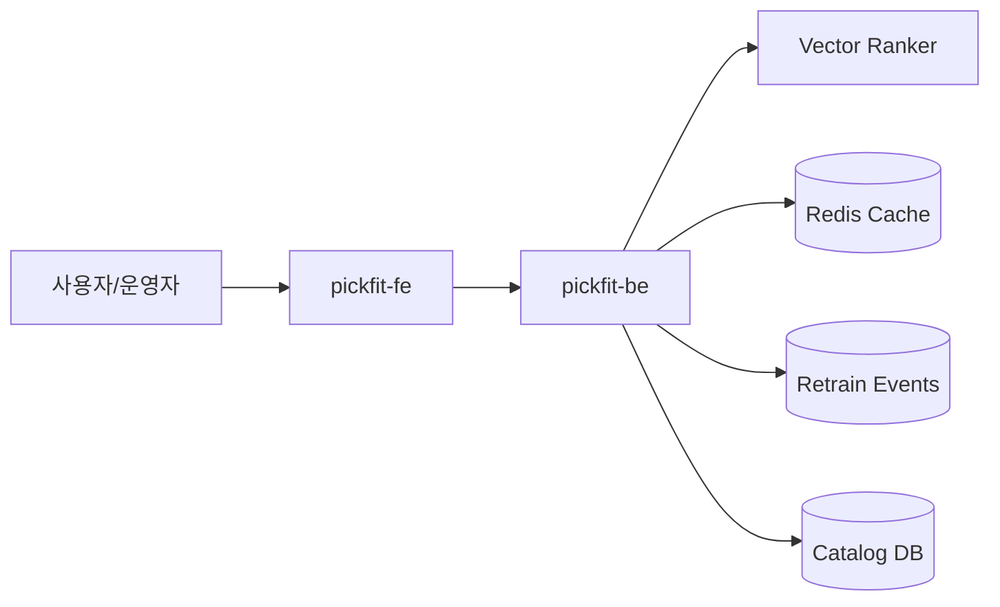

# PickFit Workspace

[](https://github.com/pickfit-ai/pickfit-workspace/actions/workflows/ci.yml)

사용자 벡터와 상품 벡터를 기반으로 개인화 추천을 제공하는 ML 서비스 워크스페이스입니다.

## 해결하는 문제

추천 시스템은 모델 자체보다 서빙 경계가 먼저 안정적이어야 합니다. PickFit은 간단한 벡터 랭킹 API, 캐시, 재학습 이벤트를 분리해 추천 서비스의 운영 골격을 보여줍니다.

## 레포 구조

| 구분 | 레포 | 설명 |
| --- | --- | --- |
| Workspace | [`pickfit-workspace`](https://github.com/cyjoon68/pickfit-workspace) | Git submodule 루트 |
| Frontend | [`pickfit-fe`](https://github.com/pickfit-ai/pickfit-fe) | Expo 기반 추천 운영 대시보드 |
| Backend | [`pickfit-be`](https://github.com/pickfit-ai/pickfit-be) | FastAPI 추천 API |

## 주요 기능

- 코사인 유사도 기반 상품 랭킹
- 추천 결과 캐시와 모델 재학습 이벤트 발행
- FastAPI 모델 서빙 경계 구성

## 아키텍처



## 기술 스택

- Frontend: Expo Router, React Native, `ky`, `react-native-unistyles`
- Backend: FastAPI, Pydantic, ML-friendly vector ranking
- Infra baseline: MySQL, Redis, RabbitMQ, GitHub Actions, ArgoCD
- Observability: Datadog, Grafana, Sentry

## 실행

```bash
git submodule update --init --recursive
cd pickfit-be && PYTHONPATH=src python3 -m pytest
cd ../pickfit-fe && npm install && npm test
```

## 운영 기준

- 기본 브랜치: `develop`
- 배포 기준: CI 통과 후 ArgoCD 동기화
- 관측 기준: recommendation latency, zero-vector rate, retrain queue depth

## 다음 개선

- sklearn 기반 offline 모델 학습 연결
- feature store 경계 추가
- 추천 결과 A/B 테스트
